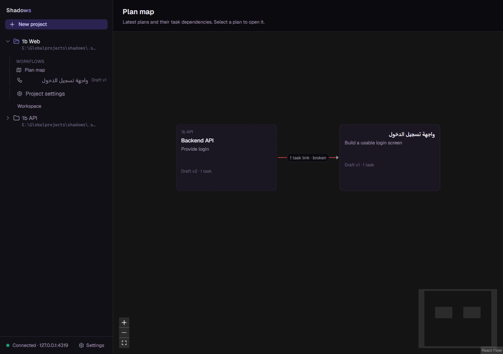
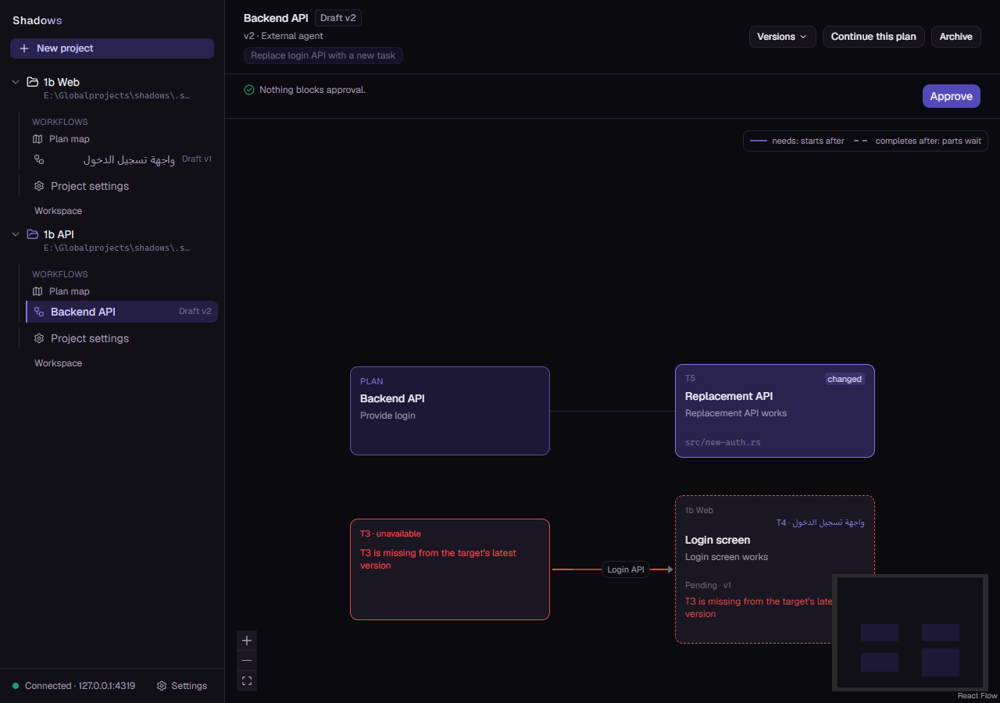

# Cross-plan links (1b): Windows verification

- Date: 2026-10-04.
- Branch: `codex/full-project-vision`, based on `e290df6`.
- Intermediate implementation: user checkpoint `dfe6070`; the remaining
  changes were verified above that checkpoint before the finishing commit.
- Owner: [§16](../superpowers/specs/2026-10-01-project-plans-design.md).
- Executed plan: [1b](../superpowers/plans/2026-10-04-cross-plan-links-1b.md).

## Automated gate

Executed on Windows, from the repository root unless noted:

```text
cargo fmt --all --check
CI's find/xargs/awk Unicode line-width check, unchanged
cargo clippy --workspace --all-targets --features fake-acp/test-support -- -D warnings
cargo test --workspace
cargo clippy --workspace -- -D warnings
cargo build --workspace
cargo tree -e features,no-dev --workspace
git diff --check
```

All completed successfully. The final Rust suite reported **402 passed,
1 ignored**; the ignored test is the existing manual database-copy migration
acceptance test. The production feature graph contained no `test-support`.
Inherited `RUST_LOG=warn` was cleared in the test subprocess. Cargo used an
existing scratch target with development debug information and incremental
compilation disabled; the product feature set was unchanged.

In `web/`, typecheck, lint, `npm test -- --maxWorkers=2` and `npm run build`
completed successfully: **187 tests in 38 files**. Regenerating API types with
`npm run gen:api` left the generated file's hash unchanged. OpenAPI and route
tests passed; `api/openapi.json` changes because the plan-map route was added.
The existing Vite warning about chunks larger than 500 kB remains.

Regression coverage includes local wire compatibility, persisted/replayed
cross-plan links, Frozen write guards, latest-target resolution, a cycle
spanning both dependency kinds, scoped incoming metadata, revoked reads after
unlink, retained archived map references and durable dependency notifications.
The stream test covers a new foreign link, unlink, restore, project removal
and replay without a duplicate notification.

## Running product trial

The trial used a disposable SQLite database and two empty project folders
under `.superpowers/sdd/2026-10-04-cross-plan-links-1b/browser-trial/`.
The daemon listened on `127.0.0.1:4319`; the production Web preview used
`127.0.0.1:5174`. The original user database and daemon were not replaced.

The existing MCP TypeScript SDK 1.30.1 drove real authenticated MCP requests;
the HTTP API created projects and grants. Grant secrets stayed in memory.
Playwright CLI controlled a fresh Edge browser at 1280×900. No AI turn was
sent: this proves the product's HTTP/MCP/browser path, not Codex or provider
execution. Claude 2.1.287 and ACP adapter 0.81.1 were startup identities only.

Observed sequence:

1. Create Backend API v1 with T3, approve it, and create a Web plan with T4
   depending on that task through a one-way project link.
2. Open the project map, navigate to the source plan, follow its remote task
   to the Backend plan and follow the incoming consumer back.
3. Continue Backend as v2, remove T3 and add T5. With the source page open,
   its graph refreshes to the broken dependency and shows the reason.
4. Click Approve on the source: HTTP returns 422, the plan stays Draft and
   the stored link remains present. The target's latest graph retains its
   incoming consumer with a missing-task placeholder.
5. Stop and restart the daemon. Reads retain one stored dependency, target
   version 2 and two map nodes with a broken edge. Reload the browser to see
   the same persisted result.

The trial exposed two UI defects, each reproduced before its fix and covered
by a passing regression test: an incoming dependency disappeared when its
local target task was removed; another expanded project's sidebar missed
live refreshes. Missing-task placeholders now retain incoming edges, and
visible project lists share reference-counted project streams.

The fresh production-preview browser reported **0 console errors and
0 warnings**. Earlier development sessions include expected approval refusal,
connection failure during the controlled shutdown and an HMR warning; these
are not reported as a clean production session. Daemon logs recorded graceful
shutdown and restart with no interrupted turns or recovery anomalies. No
active-turn crash or Linux containment was tested. A trial daemon was copied
to an independent executable after Windows rejected linking over its running
Cargo executable; the final complete gate then succeeded.





## Evidence boundaries and retained output

Raw gate and trial logs remain in the ignored
`.superpowers/sdd/2026-10-04-cross-plan-links-1b/` workspace. The disposable
driver source is removed after recording this evidence. This is agent-operated
Windows acceptance, not Mohammed's acceptance or an independent branch review.
No push, PR or merge is included. Shared agreements, context compilation,
executor/manager, Codex integration and extensions remain later work.

The four changed Rust files above 300 lines keep one responsibility:
`plans/mod.rs` routes plan operations; `projects/store.rs` persists project
lifecycle; `cross_plan_resolution.rs` tests dependency resolution;
`project_events.rs` tests the real project stream contract. They remain below
500 lines; their added cases belong to those existing responsibilities.
